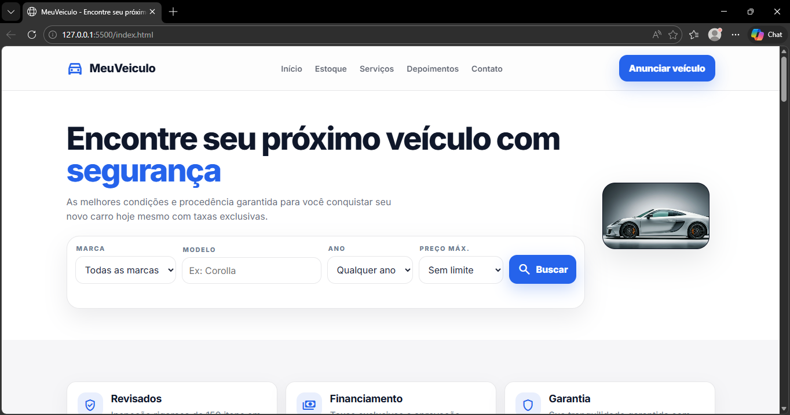
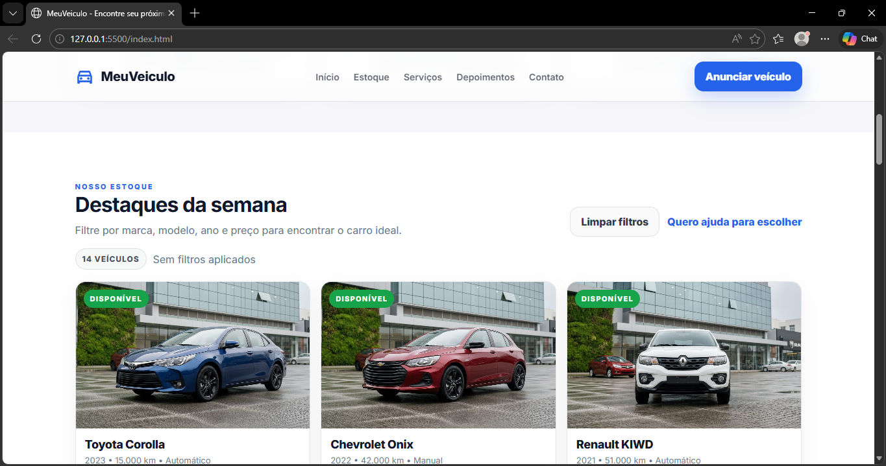

# MeuVeiculo

Landing page + vitrine de veículos para uma plataforma fictícia de compra e anúncio de carros, com layout moderno e seção de estoque/destaques.

## Preview

> Prints do projeto em `acents/imagens`

## Funcionalidades

- Navbar com links para seções do site
- Seção Hero com chamada principal e formulário de busca
- Filtros de busca (marca, modelo, ano e preço máximo)
- Seção “Destaques da semana” com cards de veículos
- Botões de ação como “Limpar filtros” e “Anunciar veículo”
- Layout responsivo (ajustes para diferentes tamanhos de tela)

## Tecnologias

- HTML5
- CSS3
- JavaScript 

